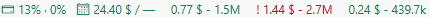
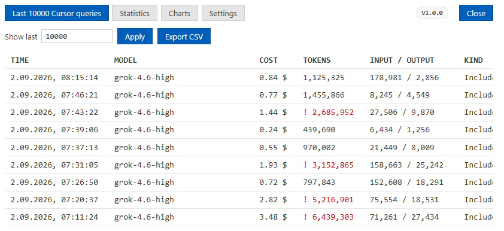
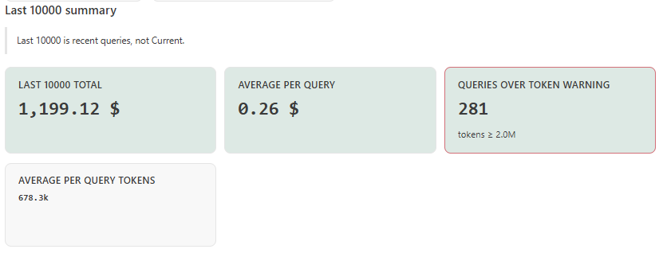
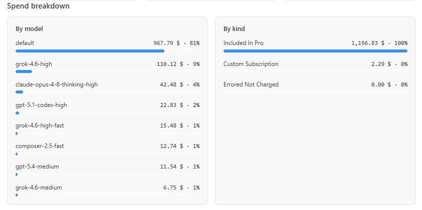
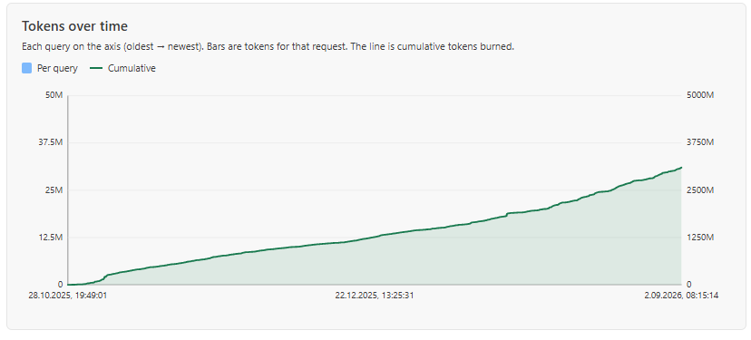
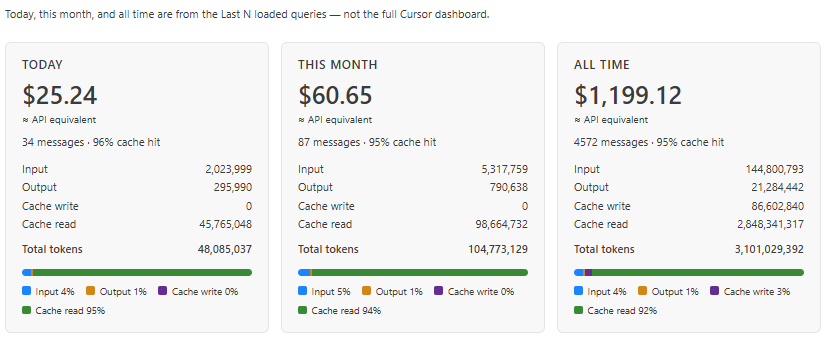

<div align="center">


# Cursor Cost Tracker

</div>

<p align="center">
  <strong>See Cursor AI spend without leaving the editor.</strong>
</p>

<p align="center">
  Current, Today, and the last 3 queries on the status bar.
  One click opens Last N queries (100–10,000, default 1,000): table, Statistics,
  Charts, and Settings. Export CSV. No extra app. No pasted token.
  No data sent anywhere except Cursor’s own usage APIs.
</p>

<p align="center">
  <a href="LICENSE"></a>
  
  
</p>

---

**Cursor Cost Tracker** is a VS Code / Cursor extension that puts **Current**, **Today**, and the **3 newest queries** on the status bar. Click any of those chips to open a panel with four tabs:

- **Last N** — newest queries first (`TIME`, `MODEL`, `COST`, `TOKENS`, `INPUT / OUTPUT`, `KIND`). **Show last** is 100–10,000 (default 1,000). **Export CSV**.
- **Statistics** — Current/Today glossary, Last N totals and averages, queries over the token warning, spend by model and by kind.
- **Charts** — tokens and cost over time (per query + cumulative), plus **Today / This month / All time** mix cards (from the loaded sample, not the full Cursor dashboard).
- **Settings** — Warn at, Show last, Show warnings, Good/Warning colors.

If you are already signed in to Cursor, there is nothing to configure.

| Status bar | History |
|------------|----------|
| Pro percents or team `$ / $` · Today · last 3 (`cost - tokens`, `!` on a spike) | Last N · Statistics · Charts · Settings |

---

## Screenshots

**Status bar** — Current, Today, and the last 3 queries. A red `!` marks a query over your token warning.



**Last N queries** — table of loaded events, Show last + Apply, Export CSV. Four tabs including Charts and Settings.



**Statistics** — Last N total spend, average per query, queries over the token warning, average tokens.



**Spend breakdown** — cost by model and by kind, with share bars.



**Charts** — tokens over time: per-query bars and a cumulative line.



**Period mix** — Today, This month, and All time: API-equivalent cost, cache hit, input / output / cache tokens.



---

## Why Cursor Cost Tracker?

Cursor’s built-in dashboard shows aggregated totals on the website. While you code, you do not see how much of the monthly limit is used, how much of the daily budget is left, or which recent query was expensive.

This extension keeps those numbers next to Git and Problems — the same place you already look.

| Capability | Cursor Dashboard | Cursor Cost Tracker |
|------------|:----------------:|:-------------------:|
| Current cycle spend on the status bar | — | Yes |
| Today vs remaining daily budget | — | Yes |
| Last N queries inside the editor (100–10,000) | — | Yes |
| Per-query cost, tokens, model, kind | Website only | Yes |
| Statistics (totals, averages, spike count) | Website | Yes |
| Spend by model and by kind | Website | Yes |
| Charts (tokens/cost over time) | — | Yes |
| Today / This month / All time mix cards | Website | Yes |
| Last 3 queries on the status bar | — | Yes |
| Token-spike warning (`!`, default 1M) | — | Yes |
| Export recent queries as CSV | — | Yes |
| Ignore a spike and keep it dismissed | — | Planned |
| Zero setup (local Cursor session) | — | Yes |
| No token pasted into Settings | — | Yes |

Not in scope: payments, team dashboards, other IDEs, estimating cost *before* you send a prompt, or rewriting your code to “save tokens.”

---

## Features

### Real-time status bar

Always-on **Current** (Pro: included-quota percents such as `13% · 0%`; Team: used vs dollar cap), **Today** (spend vs daily budget, or `—` when there is no cap), and the **3 newest queries** (`cost - tokens`). A query at or above your token warning (default **1,000,000**, configurable) shows `!` in red. **Unlimited** plans show the cycle total and hide Today. Refresh stays on the bar.

Colors: **Team** is **green** within the dollar pool and **red** at or over the cap. **Pro** Current/Today stay green. Recent queries go **red** on a token spike. Defaults are darker on a light theme so they stay readable.

### Last N Cursor queries

Click Current, Today, or a recent query to open a native editor panel. Newest first. **Show last** (100–10,000, default 1,000) sits above the table — type the full number, then **Apply**. Columns:

`TIME` · `MODEL` · `COST` · `TOKENS` · `INPUT / OUTPUT` · `KIND`

Four tabs: **Last N** · **Statistics** · **Charts** · **Settings**. **Export CSV** on the table. **Open Dashboard** on Statistics. No intermediate menu.

### Statistics

Last N sample totals (not the Current pool): total spend, average per query, average tokens, **Queries over token warning**. Spend breakdown **by model** and **by kind** with share bars.

### Charts

- **Tokens over time** and **Cost over time** — each loaded query on the axis (oldest → newest). Bars are that request; the line is cumulative.
- **Today / This month / All time** cards — API-equivalent cost, messages, cache hit, input / output / cache write / cache read, and a mix bar. Figures come from the Last N loaded queries, not the full Cursor website dashboard.

### Token-spike warning

A `!` on that recent-query chip and on the matching **TOKENS** cell when a query is at or above your token threshold (default **1,000,000**). Settings: **Warn at** in **k**, plus Show warnings.

### Zero setup

The extension reads the local Cursor session from `state.vscdb` — the same login Cursor already uses. No API key, no cookie to copy from the browser, no `.env`.

### Auto refresh

Polling every 5 minutes by default (configurable). Manual **Refresh** on the status bar after a long agent run. Startup never blocks the editor on the network.

### Local and private

The session token stays in the extension host. It is never sent to the history panel, never written to logs, and never stored in Settings. Requests go only to Cursor’s usage APIs. No analytics and no third-party telemetry.

---

## Requirements

- [Cursor](https://cursor.com) signed in on this machine
- Local session database (`state.vscdb`) — the login Cursor already uses

| OS | Session file |
|----|----------------|
| Windows | `%APPDATA%\Cursor\User\globalStorage\state.vscdb` |
| macOS | `~/Library/Application Support/Cursor/User/globalStorage/state.vscdb` |
| Linux | `~/.config/Cursor/User/globalStorage/state.vscdb` |

VS Code can install the VSIX, but numbers appear only if Cursor is installed and you are logged in (the extension reads Cursor’s user data, not VS Code’s).

Remote SSH / cloud workspaces: the session file lives on the **local** UI machine. If the extension host cannot read it, the status bar shows an error instead of numbers.

---

## Install

Cursor does **not** install third-party extensions from the Microsoft Visual Studio Marketplace. Until this project is on [Open VSX](https://open-vsx.org/), install a local VSIX:

1. Build: `npm run package`
2. In Cursor: **Extensions** → `…` → **Install from VSIX…**
3. Reload the window

Or from a terminal:

```bash
cursor --install-extension cursor-cost-tracker-1.0.0.vsix
```

After publish, search **Cursor Cost Tracker** in **Cursor → Extensions**.

---

## Status bar

Right side of the bar.

```
… │  3.79 $ / 250.00 $  │  Today 3.79 $ / 11.19 $  │  0.03 $ - 64.8k  │  0.10 $ - 237.0k  │  ! 1.20 $ - 1.2M  │  ↻  │
```

| Item | Shows | Click |
|------|--------|-------|
| **Current** | Used vs plan/limit for the billing cycle (`Unlimited` when the plan has no cap) | Opens Last N |
| **Today** | Spend vs daily budget | Opens Last N |
| **Last 3 queries** | `cost - compact tokens` for the newest queries | Opens Last N |
| **Refresh** | Sync icon | Refreshes only — no panel |

A `!` prefixes a recent query (and the table **TOKENS** cell) when that query is at or above the token threshold (default 1,000,000).

---

## History panel

Open from the status bar, or **Command Palette → Cursor Cost: Show Usage History**. The **Settings** tab has **Warn at** in **k** (1 = 1,000 tokens; spinner steps 100k) and **Show last** (100–10,000, default 1,000).

| TIME | MODEL | COST | TOKENS | INPUT / OUTPUT | KIND |
|------|-------|------|--------|----------------|------|
| `1.09.2026, 10:05:12` | default | 0.03 $ | 64,755 | 12,856 / 168 | Included In Business |

| Action | How |
|--------|-----|
| Open | Click Current / Today / a recent query, or Command Palette |
| Close | Panel **X** |
| Refresh | Status-bar sync, or **Cursor Cost: Refresh** |

---

## Commands

| Command | What it does |
|---------|----------------|
| `Cursor Cost: Show Usage History` | Opens the recent-queries panel |
| `Cursor Cost: Refresh` | Fetches latest usage |
| `Cursor Cost: Open Dashboard` | Opens cursor.com/dashboard |
| `Cursor Cost: Export recent queries CSV` | Save-as dialog for the recent-queries table |

---

## Configuration

| Setting | Default | Notes |
|---------|---------|--------|
| `cursorCost.pollIntervalMinutes` | `5` | Auto-refresh interval |
| `cursorCost.showStatusBar` | `true` | Hide the bar if you only want the command |
| `cursorCost.showToday` | `true` | Hide the Today item |
| `cursorCost.minimalMode` | `false` | Status bar shows only Current (+ Refresh) |
| `cursorCost.spikeTokenThreshold` | `1000000` | Minimum `1000`. Settings tab edits this in **k** (100 = 100k tokens) |
| `cursorCost.showSpikeWarning` | `true` | Off = no `!` and no green/red colors |
| `cursorCost.historyLimit` | `1000` | Newest queries to load (100–10,000). Settings tab: **Show last** |
| `cursorCost.okColor` | `#89D185` | Good-state color (darker green on light themes) |
| `cursorCost.warnColor` | `#F14C4C` | Warning color (darker red on light themes) |

---

## FAQ

**How is this different from Cursor’s usage page?**  
Cursor’s dashboard shows aggregated totals in the browser. This extension shows Current, Today, and the last 3 queries on the status bar, plus Last N queries (100–10,000) in the editor with Statistics, Charts, period mix cards, and CSV export.

**Do I need to paste a session token?**  
No. If Cursor is signed in on this machine, the extension reads the local session. There is no token field in Settings.

**Does it work on the Free plan?**  
Yes, as long as you are signed in to Cursor on this machine. Unlimited plans hide Today and show the cycle total as Unlimited.

**What is the token-spike `!`?**  
A `!` on that recent-query chip (and on the table **TOKENS** cell) when a single query is at or above your threshold (default 1 million tokens). It is a notice, not advice on how to cut the conversation.

**Is my token safe?**  
The access token never leaves the extension host. It is not sent to the webview, not written to logs, and not stored in Settings. No data is sent to third-party servers.

**Can I use this in VS Code without Cursor?**  
You can install the VSIX, but usage data requires Cursor’s local session. Without it the bar shows a sign-in message instead of numbers.

**Are the numbers an invoice?**  
No. This tool uses unofficial Cursor usage APIs and a local session file. Cursor may change either without notice. Treat the overlay as a convenience, not a billing statement.

---

## Troubleshooting

| Symptom | What to do |
|---------|------------|
| `N/A` / Sign in | Sign in to Cursor on this machine, then Refresh |
| No numbers after install | Reload the window; confirm Cursor (not only VS Code) is installed |
| Today missing | Unlimited plan, or the events request failed — Current can still show |
| Empty history table | Use Cursor AI at least once, then Refresh |
| Remote SSH / cloud | Session file is on the local UI machine; the bar shows an error if the host cannot read it |
| Stale numbers after a long agent run | Click Refresh |

This project aims to follow Cursor plan and API changes quickly. Display or totals may drift when Cursor changes the usage endpoints. Reports with a masked response sample, plan type, and time of occurrence help land a fix faster — open an [Issue](https://github.com/Lukasz0303/cursor-cost-tracker/issues).

---

## Privacy

- Session token: extension host only. Never in the webview, logs, or Settings.
- Network: `cursor.com` usage APIs only.
- Storage: local Cursor session only. No cloud database.
- No analytics, no third-party telemetry.

This is **not** an official Cursor product.

---

## License

[MIT](LICENSE) — Copyright (c) 2026 Łukasz Zileiński.

Anyone may use, copy, modify, merge, publish, and sell the software, provided they keep the copyright notice and the MIT text. There is **no warranty**. You are not liable if it breaks, shows a wrong dollar amount, or Cursor’s API changes.

MIT is a permission, not a transfer of ownership. It does **not** grant Cursor’s trademarks. Do not imply this is official Cursor software. Unofficial API use is not “approved” by Cursor; the disclaimer in this README still applies.

---

## Publishing

Cursor installs third-party extensions from **[Open VSX](https://open-vsx.org/)**, then its own marketplace proxy (malware scan + sync, often a few hours). Microsoft Marketplace is optional and does not help Cursor users.

```bash
npm run build
npx @vscode/vsce package --no-dependencies
npx ovsx publish cursor-cost-tracker-1.0.0.vsix -p %OVSX_PAT%
```

`engines.vscode` must be **≤** the VS Code version in Cursor **Help → About**, or Cursor hides the extension in search. Keep `LICENSE` and **`icon.png`** inside the VSIX. Marketplace listing uses `"icon": "icon.png"` (PNG, at least 128×128).

Private / team only: skip stores, ship the VSIX, **Install from VSIX**.

---

## Contributing

Contributions welcome.

1. Fork
2. `git checkout -b feature/your-change`
3. Open a pull request

Product requirements: [`.ai/context/prd.md`](.ai/context/prd.md).
