<div align="center">


# Cursor Cost Tracker

</div>

<p align="center">
  <strong>Status bar for Cursor spend — and a monthly cost forecast before the bill surprises you.</strong>
</p>

<p align="center">
  Always-on <strong>Current</strong>, <strong>Today</strong>, and <strong>1–10 recent queries</strong> (default 3)
  on the IDE status bar. Click Current or Today to open <strong>Statistics</strong> with
  <strong>Monthly cost forecast</strong> (used · forecast · ideal · run-out date).
  A query chip opens Last N (100–10,000). No extra app. No pasted token.
  No data sent anywhere except Cursor’s own usage APIs.
</p>

<p align="center">
  <a href="https://open-vsx.org/extension/lukasz0303/cursor-cost-tracker"></a>
  <a href="LICENSE"></a>
  
  
</p>

---

**Cursor Cost Tracker** is a VS Code / Cursor extension whose core product is the **status bar** plus **spend prediction**:

1. **Status bar** — see cycle spend, daily pace, and the newest queries while you code (green = ok, red = over budget or token spike).
2. **Monthly cost forecast** — answer “how much will this month cost?” and “when does included quota run out?” with used / forecast / ideal lines.
3. **Last N history** — full table, Statistics, Charts, and Settings one click away.

- Click **Current** or **Today** → **Statistics** (monthly cost forecast).
- Click a **recent-query chip** → **Last N** query list.
- **Refresh** on the bar only syncs. **Export CSV** is on the Last N toolbar, not the status bar.

The panel has four tabs:

- **Last N** — newest queries first (`TIME`, `MODEL`, `COST`, `TOKENS`, `INPUT / OUTPUT`, `KIND`). **Show last** is 100–10,000 (default 1,000). **Over limit only** filters to token-spike rows. **Export CSV**.
- **Statistics** — Current/Today glossary, **Monthly cost forecast** (Team dollars or Pro included percent; used / forecast / ideal; run-out date), Last N totals, average/median, cache hit, token mix, spend by model and by kind.
- **Charts** — tokens and cost over time (per query + cumulative), the same **Monthly cost forecast**, plus **Today / This month / All time** mix cards (from the loaded sample, not the full Cursor dashboard).
- **Settings** — every `cursorCost.*` key. Status-bar preview, content, warnings, and colors; **Critical alert** (blocking dialog at 10M tokens or $5); Show last; Auto-refresh interval.

If you are already signed in to Cursor, there is nothing to configure.

| Status bar (primary) | Forecast (primary) | History |
|----------------------|--------------------|---------|
| Pro percents or team `$ / $` · Today · 1–10 recent (`cost - tokens`, `!` on a spike) | Used · forecast · ideal · run-out / “lasts the month” | Last N · Statistics · Charts · Settings |

---

## Screenshots

Captures from **1.0.2**. The two features that matter most are first: the **status bar** and **Monthly cost forecast**.

### 1. Status bar — always on while you code

**Team / Business (light)** — Current as used vs dollar pool, Today vs daily budget (red when over pace), Refresh, then recent queries as `cost - tokens`.

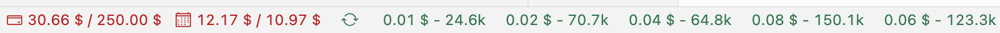

**Pro (dark)** — Current as included-quota percents (`28% · 31%`), Today in dollars, and a red `!` on a query at or above your token warning.

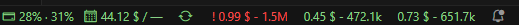

### 2. Monthly cost forecast — how much you can still spend

The headline analytics surface. Bars are that day’s burn; solid lines are cumulative used; dashed lines are the forecast if today’s working-day pace continues; dotted ideal lines spread leftover budget to month end. Range: **Today** · **7 days** · **Month**.

**Team dollars (light)** — “Lasts the month”, daily pace, and month-end forecast if the working-day pace continues.

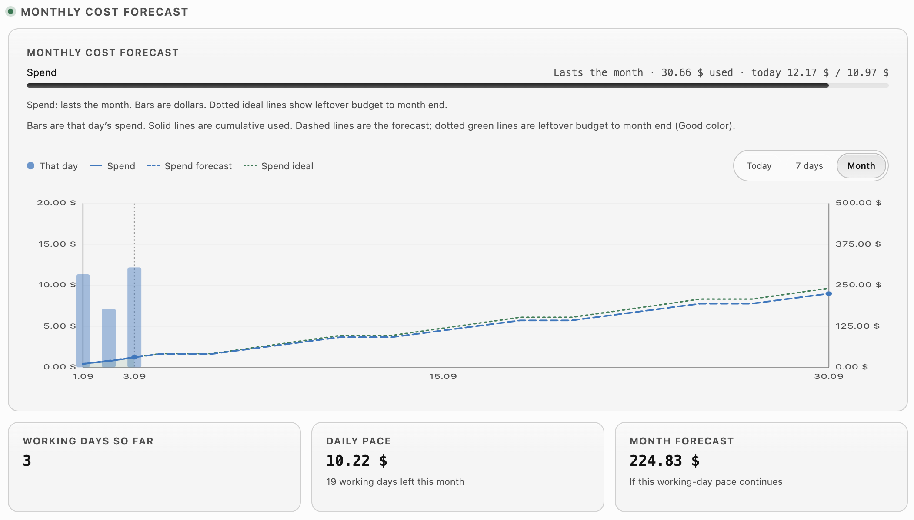

**Pro included percent (dark)** — separate Cursor Models / Other Models series, run-out dates, and ideal leftover lines to month end.

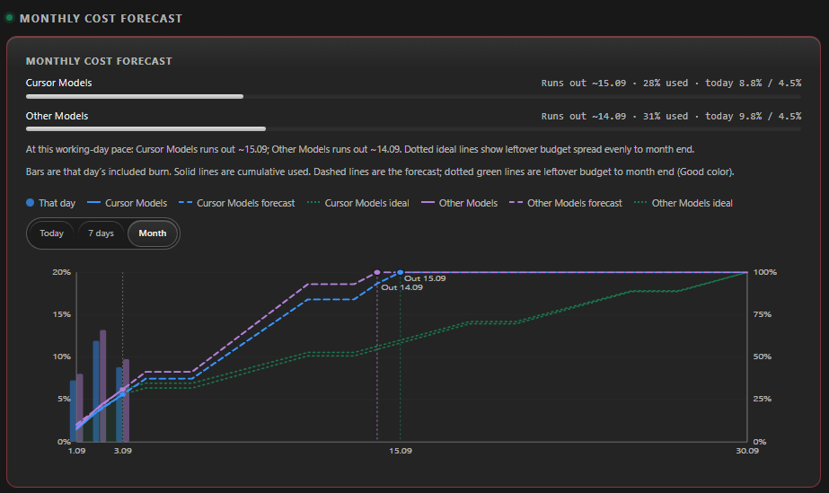

**7-day zoom (Team)** — same forecast control, focused on the next working days.

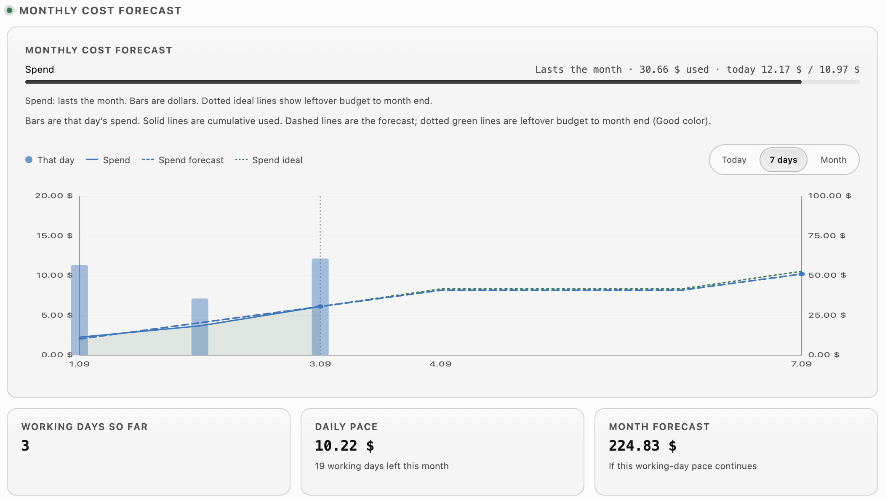

### 3. Last N Cursor queries

Full table inside the editor: Show last, **Over limit only**, **Export CSV**. Spike rows show `!` on **TOKENS**.

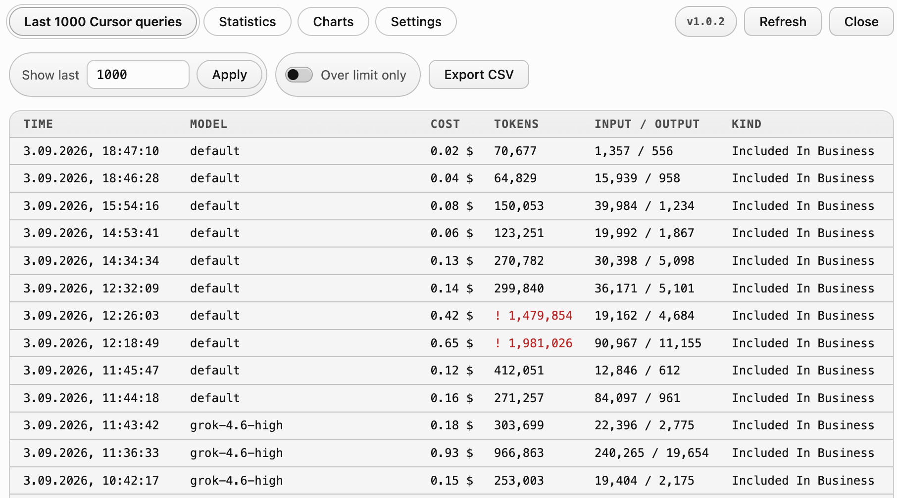

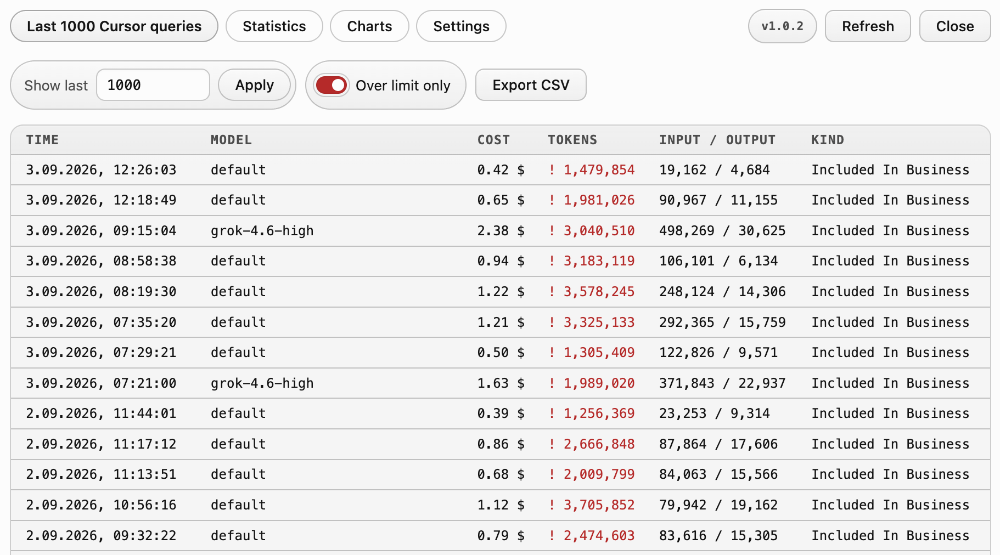

### 4. Statistics — Current / Today, sample totals, spend by model

**Current / Today meters** (Pro included bars + today’s dollar sum):

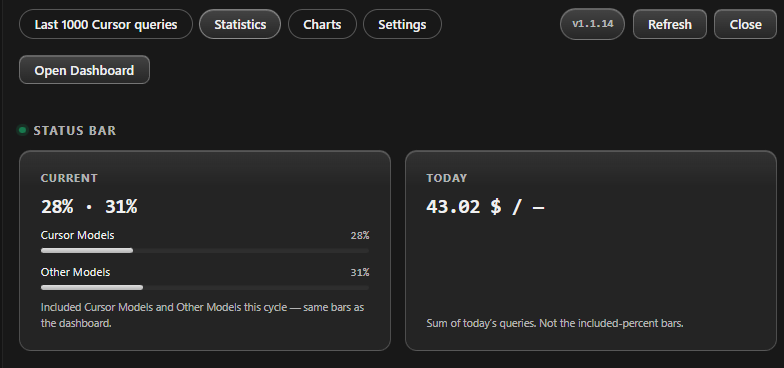

**Last N summary** — totals, average / median, cache hit, cost per 1M tokens, heaviest query, token mix:

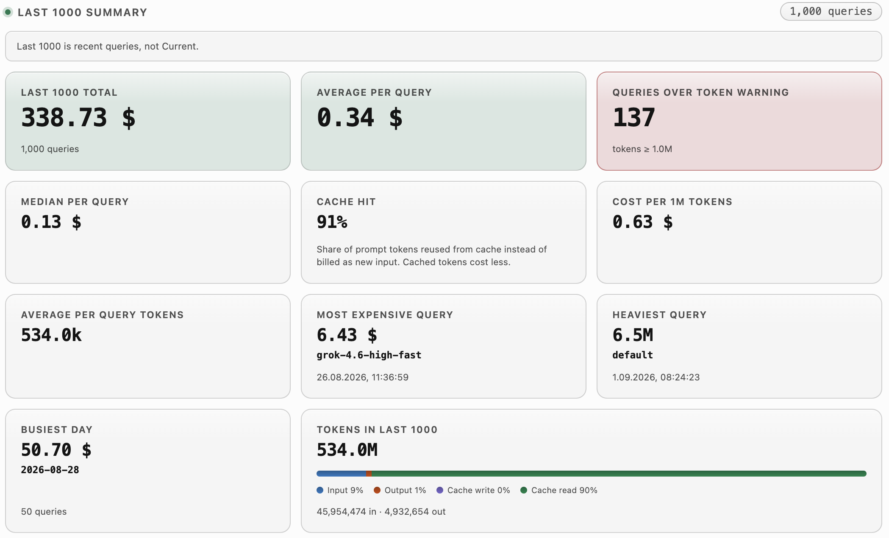

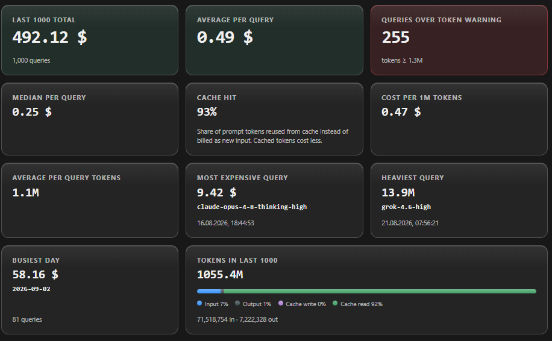

**Spend breakdown** — by model and by kind:

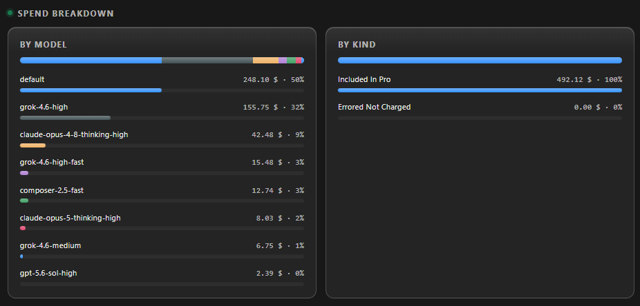

### 5. Critical alert

Blocking dialog when the **newest** query hits your critical token or dollar threshold (default 10M tokens or $5). Independent of the status-bar `!`.

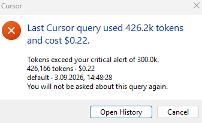

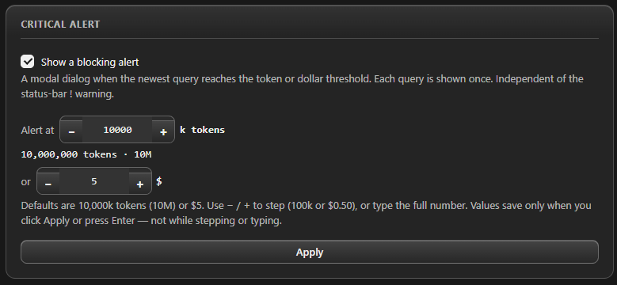

### 6. Settings — status bar preview and content

Live sample of the bar (example spend, not your totals), Show status bar, Show Today, Minimal mode, and **1–10** recent requests on the bar.

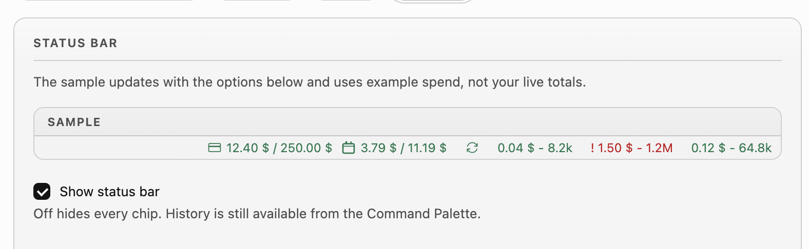

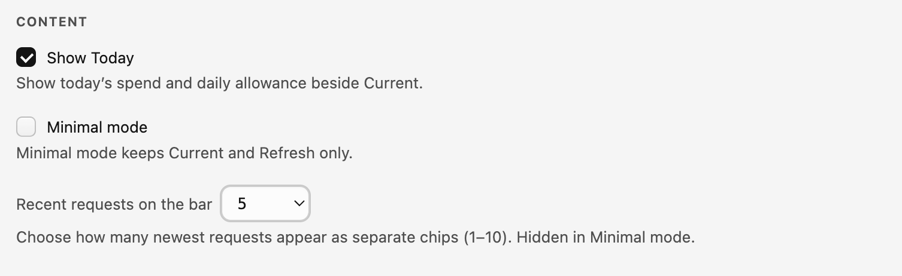

---

## Why Cursor Cost Tracker?

Cursor’s built-in dashboard shows aggregated totals on the website. While you code, you do not see how much of the monthly limit is used, how much of the daily budget is left, **what this month will cost if you keep this pace**, or which recent query was expensive.

This extension keeps those numbers next to Git and Problems — the same place you already look — and adds a **monthly forecast** so you can decide how much you can still spend.

| Capability | Cursor Dashboard | Cursor Cost Tracker |
|------------|:----------------:|:-------------------:|
| Current cycle spend on the **status bar** | — | Yes |
| Today vs remaining daily budget on the bar | — | Yes |
| **Monthly cost forecast** (used / forecast / ideal / run-out) | — | Yes |
| Last N queries inside the editor (100–10,000) | — | Yes |
| Per-query cost, tokens, model, kind | Website only | Yes |
| Statistics (totals, averages, spike count) | Website | Yes |
| Spend by model and by kind | Website | Yes |
| Charts (tokens/cost over time) | — | Yes |
| Today / This month / All time mix cards | Website | Yes |
| 1–10 recent queries on the status bar | — | Yes |
| Token-spike warning (`!`, default 1M) | — | Yes |
| Blocking alert on last query (default 10M tokens or $5) | — | Yes |
| Export recent queries as CSV | — | Yes |
| Ignore a spike and keep it dismissed | — | Planned |
| Zero setup (local Cursor session) | — | Yes |
| No token pasted into Settings | — | Yes |

Not in scope: payments, team dashboards, other IDEs, estimating cost *before* you send a prompt, or rewriting your code to “save tokens.”

---

## Features

### Real-time status bar (primary)

Always-on **Current** (Pro: included-quota percents such as `13% · 0%`; Team: used vs dollar cap), **Today** (spend vs daily budget, or `—` when there is no cap), and **1–10 newest queries** (`cost - tokens`, default 3). Click Current or Today for **Statistics** (forecast). Click a query chip for the Last N list. A query at or above your token warning (default **1,000,000**, configurable) shows `!` in red. **Unlimited** plans show the cycle total and hide Today. Refresh stays on the bar. Export CSV does not.

Colors: **Team** is **green** within the dollar pool and **red** at or over the cap (or when Today is over the daily budget). **Pro** Current/Today stay green. Recent queries go **red** on a token spike. Defaults are darker on a light theme so they stay readable.

### Monthly cost forecast (primary)

Answer two questions without opening cursor.com:

- **How much will this month cost** if the current working-day pace continues?
- **When does included quota run out** (Pro), or will the dollar pool last the month (Team / Business / Enterprise)?

**Team / Business / Enterprise** — dollars: that-day bars, cumulative Spend, dashed forecast, dotted ideal leftover, working days so far, daily pace, and month forecast. **Pro** — included percent for Cursor Models and Other Models, run-out dates, and the same used / forecast / ideal chart. Range toggle: **Today** · **7 days** · **Month** (default Month). Same control on **Statistics** and **Charts**.

### Last N Cursor queries

Click a **recent-query chip** (or Command Palette **Show Usage History**) to open the queries table. Click **Current** or **Today** to open the same panel on **Statistics**. Newest first. **Show last** (100–10,000, default 1,000) sits above the table — type the full number, then **Apply**. Columns:

`TIME` · `MODEL` · `COST` · `TOKENS` · `INPUT / OUTPUT` · `KIND`

Four tabs: **Last N** · **Statistics** · **Charts** · **Settings**. **Over limit only** and **Export CSV** on the table toolbar (not on the status bar). **Open Dashboard** on Statistics. No intermediate menu.

### Statistics

Last N sample totals (not the Current pool): total spend, average and median per query, cache hit, cost per 1M tokens, token mix, **Queries over token warning**. **Monthly cost forecast** (see above). Spend breakdown **by model** and **by kind** with share bars.

### Charts

- **Tokens over time** and **Cost over time** — each loaded query on the axis (oldest → newest). Bars are that request; the line is cumulative.
- **Monthly cost forecast** — same control as Statistics: cycle meters, Today / 7 days / Month range, that-day bars, cumulative used, dashed forecast, and dotted leftover-budget lines.
- **Today / This month / All time** cards — API-equivalent cost, messages, cache hit, input / output / cache write / cache read, and a mix bar. Figures come from the Last N loaded queries, not the full Cursor website dashboard.

### Token-spike warning

A `!` on that recent-query chip and on the matching **TOKENS** cell when a query is at or above your token threshold (default **1,000,000**). Settings: **Warn at** in **k**, plus Show warnings. On Last N, **Over limit only** hides every row that is not a spike.

### Critical last-query alert

A **blocking dialog** when the newest query reaches **10,000,000 tokens** or **$5** (either is enough). Each query is shown once. A last query older than five minutes is not shown on first load after a restart. Independent of the status-bar `!`. Settings tab: **Critical alert**. Turn off with `cursorCost.showCriticalAlert`.

### Zero setup

The extension reads the local Cursor session from `state.vscdb` — the same login Cursor already uses. No API key, no cookie to copy from the browser, no `.env`.

### Auto refresh

Polling every 1 minute by default (configurable). Manual **Refresh** on the status bar after a long agent run. Startup never blocks the editor on the network.

### Local and private

The session token stays in the extension host. It is never sent to the history panel, never written to logs, and never stored in Settings. Requests go only to Cursor’s usage APIs. No analytics and no third-party telemetry.

---

## Requirements

- [Cursor](https://cursor.com) signed in on this machine
- Local session database (`state.vscdb`) — the login Cursor already uses

| OS | Session file |
|----|----------------|
| Windows | `%APPDATA%\Cursor\User\globalStorage\state.vscdb` |
| macOS | `~/Library/Application Support/Cursor/User/globalStorage/state.vscdb` |
| Linux | `~/.config/Cursor/User/globalStorage/state.vscdb` |

VS Code can install the VSIX, but numbers appear only if Cursor is installed and you are logged in (the extension reads Cursor’s user data, not VS Code’s).

Remote SSH / cloud workspaces: the session file lives on the **local** UI machine. If the extension host cannot read it, the status bar shows an error instead of numbers.

---

## Install

Cursor installs third-party extensions from **[Open VSX](https://open-vsx.org/extension/lukasz0303/cursor-cost-tracker)** (then Cursor’s marketplace proxy). Prefer that listing when it is available in **Cursor → Extensions**.

Local VSIX:

1. Build: `npm run package`
2. In Cursor: **Extensions** → `…` → **Install from VSIX…**
3. Reload the window

Or from a terminal:

```bash
cursor --install-extension cursor-cost-tracker-1.0.2.vsix
```

Search **Cursor Cost Tracker** in **Cursor → Extensions**, or open the [Open VSX page](https://open-vsx.org/extension/lukasz0303/cursor-cost-tracker).

---

## Status bar

Right side of the bar.

```
… │  3.79 $ / 250.00 $  │  Today 3.79 $ / 11.19 $  │  ↻  │  0.03 $ - 64.8k  │  0.10 $ - 237.0k  │  ! 1.20 $ - 1.2M  │
```

| Item | Shows | Click |
|------|--------|-------|
| **Current** | Team: used vs dollar cap. Pro: included-quota percents (`Unlimited` when the plan has no cap) | Opens **Statistics** |
| **Today** | Spend vs daily budget (hidden on unlimited plans) | Opens **Statistics** |
| **Refresh** | Sync icon (spins while fetching) | Pulls latest usage from cursor.com — no panel |
| **Recent queries (1–10)** | `cost - compact tokens` for the newest queries | Opens the **Last N** list |

A `!` prefixes a recent query (and the table **TOKENS** cell) when that query is at or above the token threshold (default 1,000,000). Export CSV is on the Last N toolbar, not here.

---

## History panel

The **Settings** tab is a full editor for every `cursorCost.*` key. Status-bar preview, content, warnings, and colors are grouped into separate cards. **Show last** is 100–10,000 (default 1,000). **Auto-refresh** is 1–60 minutes.

| TIME | MODEL | COST | TOKENS | INPUT / OUTPUT | KIND |
|------|-------|------|--------|----------------|------|
| `1.09.2026, 10:05:12` | default | 0.03 $ | 64,755 | 12,856 / 168 | Included In Business |

| Action | How |
|--------|-----|
| Open | Current / Today → Statistics; a recent-query chip or Command Palette → Last N |
| Close | Panel **X** |
| Refresh | Status-bar sync, Last N **Refresh**, or **Cursor Cost: Refresh** |
| Export CSV | Last N **Export CSV**, or **Cursor Cost: Export recent queries CSV** |

---

## Commands

| Command | What it does |
|---------|----------------|
| `Cursor Cost: Show Usage History` | Opens the recent-queries panel |
| `Cursor Cost: Refresh` | Fetches latest usage |
| `Cursor Cost: Open Dashboard` | Opens cursor.com/dashboard |
| `Cursor Cost: Export recent queries CSV` | Save-as dialog for the recent-queries table |

---

## Configuration

| Setting | Default | Notes |
|---------|---------|--------|
| `cursorCost.pollIntervalMinutes` | `1` | Auto-refresh interval. Settings tab: **Auto-refresh** |
| `cursorCost.showStatusBar` | `true` | Hide the bar if you only want the command. Settings: status bar editor |
| `cursorCost.showToday` | `true` | Hide the Today item. Settings: status bar editor |
| `cursorCost.minimalMode` | `false` | Status bar shows only Current (+ Refresh). Settings: status bar editor |
| `cursorCost.recentQueryCount` | `3` | Number of recent request chips on the status bar (1–10) |
| `cursorCost.spikeTokenThreshold` | `1000000` | Minimum `1000`. Settings tab edits this in **k** (100 = 100k tokens) |
| `cursorCost.showSpikeWarning` | `true` | Off = no `!` and no green/red colors |
| `cursorCost.showCriticalAlert` | `true` | Blocking dialog when the newest query hits the critical token or dollar threshold |
| `cursorCost.criticalTokenThreshold` | `10000000` | Minimum `1000`. Settings tab in **k** (10000 = 10M tokens) |
| `cursorCost.criticalCostUsdThreshold` | `5` | Minimum `$0.01`. Either this or the token threshold is enough |
| `cursorCost.historyLimit` | `1000` | Newest queries to load (100–10,000). Settings tab: **Show last** |
| `cursorCost.okColor` | `#89D185` | Good-state color (darker green on light themes) |
| `cursorCost.warnColor` | `#F14C4C` | Warning color (darker red on light themes) |

---

## FAQ

**How is this different from Cursor’s usage page?**  
Cursor’s dashboard shows aggregated totals in the browser. This extension puts **Current**, **Today**, and **1–10 recent queries** on the status bar, and a **Monthly cost forecast** (used / forecast / ideal / run-out) so you can see how much you can still spend this month. Current/Today open Statistics; query chips open Last N (100–10,000) with Charts, period mix cards, and CSV export.

**Can it predict my month-end bill?**  
It forecasts from your **working-day pace so far** (Team dollars or Pro included percent). It is a pace projection, not an invoice — Cursor’s bill can still differ.

**Do I need to paste a session token?**  
No. If Cursor is signed in on this machine, the extension reads the local session. There is no token field in Settings.

**Does it work on the Free plan?**  
Yes, as long as you are signed in to Cursor on this machine. Unlimited plans hide Today and show the cycle total as Unlimited.

**What is the token-spike `!`?**  
A `!` on that recent-query chip (and on the table **TOKENS** cell) when a single query is at or above your threshold (default 1 million tokens). It is a notice, not advice on how to cut the conversation.

**What is the critical alert?**  
A blocking dialog when the **newest** query reaches 10 million tokens or $5 (configurable). It is shown once per query. A last query older than five minutes is not shown on first load after a restart.

**Is my token safe?**  
The access token never leaves the extension host. It is not sent to the webview, not written to logs, and not stored in Settings. No data is sent to third-party servers.

**Can I use this in VS Code without Cursor?**  
You can install the VSIX, but usage data requires Cursor’s local session. Without it the bar shows a sign-in message instead of numbers.

**Are the numbers an invoice?**  
No. This tool uses unofficial Cursor usage APIs and a local session file. Cursor may change either without notice. Treat the overlay as a convenience, not a billing statement.

---

## Troubleshooting

| Symptom | What to do |
|---------|------------|
| `N/A` / Sign in | Sign in to Cursor on this machine, then Refresh |
| No numbers after install | Reload the window; confirm Cursor (not only VS Code) is installed |
| Today missing | Unlimited plan, or the events request failed — Current can still show |
| Empty history table | Use Cursor AI at least once, then Refresh |
| Remote SSH / cloud | Session file is on the local UI machine; the bar shows an error if the host cannot read it |
| Stale numbers after a long agent run | Click Refresh |

This project aims to follow Cursor plan and API changes quickly. Display or totals may drift when Cursor changes the usage endpoints. Reports with a masked response sample, plan type, and time of occurrence help land a fix faster — open an [Issue](https://github.com/Lukasz0303/cursor-cost-tracker/issues).

---

## Privacy

- Session token: extension host only. Never in the webview, logs, or Settings.
- Network: `cursor.com` usage APIs only.
- Storage: local Cursor session only. No cloud database.
- No analytics, no third-party telemetry.

This is **not** an official Cursor product.

---

## License

[MIT](LICENSE) — Copyright (c) 2026 Łukasz Zileiński.

Anyone may use, copy, modify, merge, publish, and sell the software, provided they keep the copyright notice and the MIT text. There is **no warranty**. You are not liable if it breaks, shows a wrong dollar amount, or Cursor’s API changes.

MIT is a permission, not a transfer of ownership. It does **not** grant Cursor’s trademarks. Do not imply this is official Cursor software. Unofficial API use is not “approved” by Cursor; the disclaimer in this README still applies.

---

## Publishing

Cursor installs third-party extensions from **[Open VSX](https://open-vsx.org/)**, then its own marketplace proxy (malware scan + sync, often a few hours). Microsoft Marketplace is optional and does not help Cursor users.

```bash
npm run build
npx @vscode/vsce package --no-dependencies
npx ovsx publish cursor-cost-tracker-1.0.2.vsix -p %OVSX_PAT%
```

`engines.vscode` must be **≤** the VS Code version in Cursor **Help → About**, or Cursor hides the extension in search. Keep `LICENSE`, **`icon.png`**, and **`CHANGELOG.md`** inside the VSIX (Changelog tab on Open VSX / Cursor Extensions). Marketplace listing uses `"icon": "icon.png"` (PNG, at least 128×128).

Private / team only: skip stores, ship the VSIX, **Install from VSIX**.

---

## Changelog

Full notes: [CHANGELOG.md](CHANGELOG.md). That file is the **Changelog** tab on Open VSX and in Cursor → Extensions.

---

## Contributing

Contributions welcome.

1. Fork
2. `git checkout -b feature/your-change`
3. Open a pull request

Product requirements: [`.ai/context/prd.md`](.ai/context/prd.md).
