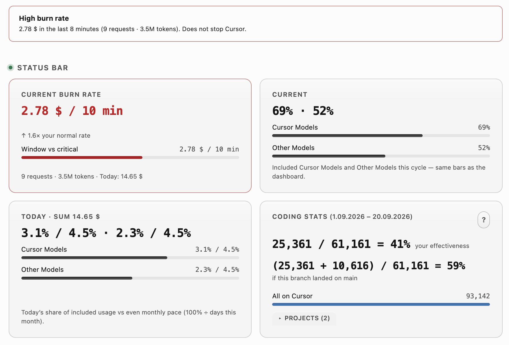
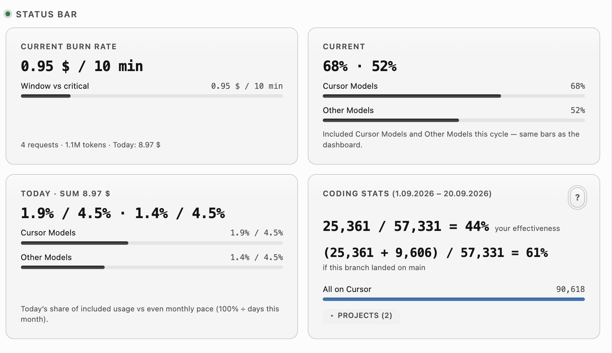
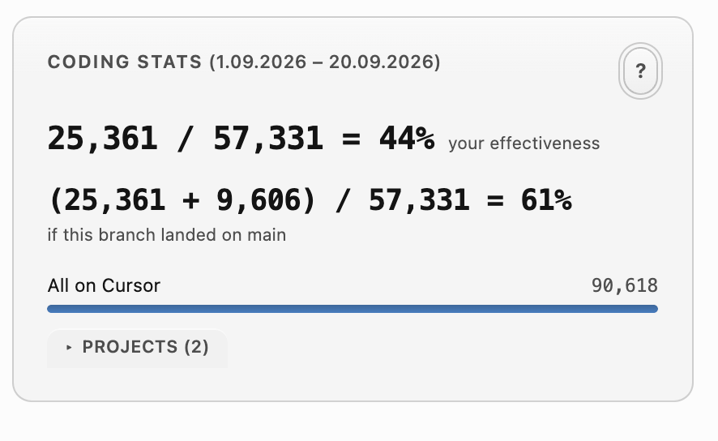
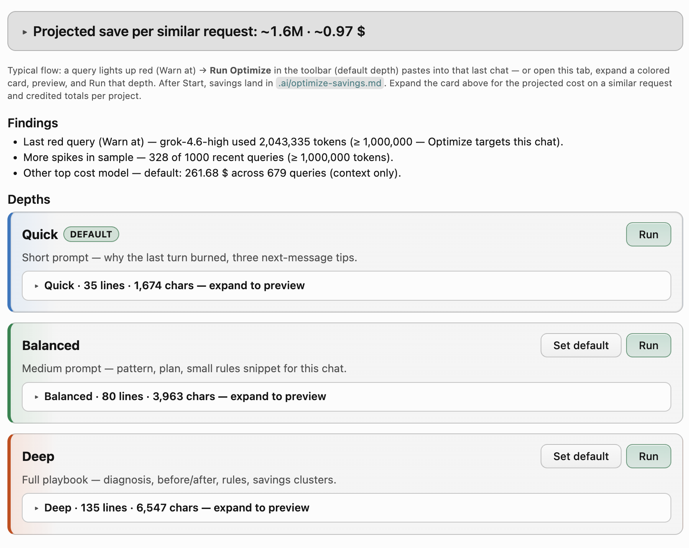
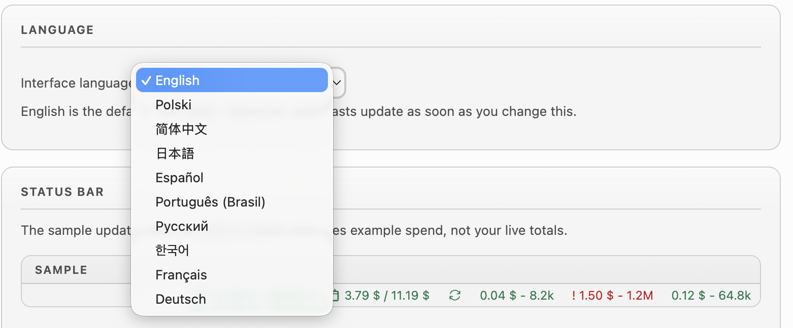

<div align="center">


# Cursor Cost Tracker

</div>

<p align="center">
  <strong>See spend · catch spikes · forecast the month · Optimize locally · see what landed.</strong>
</p>

<p align="center">
  Always-on <strong>Current</strong>, <strong>Today</strong>, and <strong>1–10 recent queries</strong> on the
  status bar. <strong>Statistics</strong> shows live <strong>burn rate</strong>, Pro meters, and
  <strong>Coding stats</strong> (AI vs what landed). A <strong>blocking critical alert</strong> fires when one
  query blows past your token or dollar ceiling. <strong>Monthly cost forecast</strong> and
  <strong>Optimize</strong> stay in the editor — savings in <code>.ai/optimize-savings.md</code> only.
  No extra app. No pasted token.
</p>

<p align="center">
  <a href="https://open-vsx.org/extension/lukasz0303/cursor-cost-tracker"></a>
  <a href="LICENSE"></a>
  
  
  <a href="https://buymeacoffee.com/lzzzielinsn"></a>
</p>

---

**Cursor Cost Tracker** is a VS Code / Cursor extension with five jobs:

1. **Status bar** — Current, Today, and the newest queries stay on the bar while you code. Green is on pace; red is over budget or a token spike (`!`).
2. **Guards** — **Burn Rate Guard** shows live `$ / window` on Statistics, a banner when that window is hot, and non-blocking toasts. A **blocking critical alert** fires when the newest query hits your token or dollar ceiling (**Open History** / **Ignore**). Neither stops Cursor.
3. **Monthly cost forecast** — used, forecast, and ideal on one chart, plus **when** Team dollars or Pro included limits run out.
4. **Optimize** — ready prompts for the last red (**Warn at**) query. Projected savings stay in this project’s **`.ai/optimize-savings.md`** only — the extension never reads the chat.
5. **Coding stats** — analysis of AI-generated code vs what actually landed: **`landed / AI = %`** (your effectiveness), the same if this branch merged to `main`/`master`, and **All on Cursor** (dashboard Lines Edited) split by project.

Click **Current** or **Today** for Statistics (burn rate, Coding stats, forecast). Click a **recent-query chip** for the Last N list. **Refresh** only syncs; **Export CSV** is on the Last N toolbar. **Run Optimize** pastes into the last chat — savings appear after you press Start.

The panel has six tabs:

- **Last N** — newest queries first (`TIME`, `MODEL`, `COST`, `TOKENS`, `INPUT / OUTPUT`, `KIND`). **Show last** is 100–10,000 (default 1,000), or **From date** (e.g. start of month). **Export CSV**.
- **Statistics** — **Current burn rate**, Current/Today meters, **Coding stats** (`landed / AI = %` · if this branch landed · All on Cursor), **Monthly cost forecast**, Last N totals, spend by model and by kind.
- **Charts** — cumulative daily **tokens** and **cost** bars, **AI vs git** with the same Coding stats formulas, the same **Monthly cost forecast**, plus **Today / This month / All time** mix cards.
- **Optimize** — Quick / Balanced / Deep prompts for the last red query; projected save card from `.ai/optimize-savings.md`.
- **Support** — Buy Me a Coffee if the tracker paid for itself.
- **Settings** — **Language** (10 locales); status bar; **Critical alert**; **Burn Rate Guard**; **Generated lines** (Coding stats); Optimize depth; Show last / From date; Auto-refresh.

If you are already signed in to Cursor, there is nothing to configure.

| Status bar | Guards | Forecast | Optimize | Coding stats |
|------------|--------|----------|----------|--------------|
| Pro `%` or team `$ / $` · Today · 1–10 recent (`!` on a spike) | Burn `$ / 10 min` · critical modal on huge queries | Used · forecast · ideal · run-out | Last red · local savings file | Landed / AI · All on Cursor |

---

## Screenshots

Captures from **1.0.4**.

### 1. Statistics — high burn rate

When the live window is over your warning or critical dollar floor, Statistics shows a **High burn rate** banner plus the Status bar row: **Current burn rate** (`$ / 10 min`, optional `×` vs your pace), **Current** / **Today** Pro meters, and **Coding stats**. Does not stop Cursor.



### 2. Statistics — Status bar row (normal)

The same four cards when burn is under the warning floor: **Current burn rate**, **Current**, **Today**, and **Coding stats** (`landed / AI = %` · if this branch landed · All on Cursor).



### 3. Coding stats

Hero is **landed / AI = %** (your effectiveness) for this repo in the Last N / From date window, plus the same **if this branch landed** on main. **All on Cursor** is the dashboard Lines Edited total; **Projects** splits that total by local composer mix. Help `?` explains the formulas.



### 4. Critical alert — blocking dialog on a huge query

When the newest query hits your critical token or dollar threshold, a modal shows tokens, cost, model, and time — **Open History** or **Cancel**. Independent of the status-bar `!`.


### 5. Status bar — always on while you code

**Team / Business (light)** — Current as used vs dollar pool, Today vs daily budget (red when over pace), Refresh, then recent queries as `cost - tokens`.


**Pro (dark)** — Current as mean included % vs 100% (`32% / 100%`), Today as mean today % / daily pace with today’s `$` (`3.5% / 4.5% (17.12 $)`), and a red `!` on a query at or above your token warning.


### 6. Monthly cost forecast — when money / limits run out

Bars and solid lines are cumulative used on one scale; dashed lines are the forecast; dotted ideal lines spread leftover budget to month end. Range: **Today** · **7 days** · **Month**.

**Team dollars (light)** — “Lasts the month”, daily pace, and month-end forecast if the working-day pace continues.


**Pro included percent (dark)** — separate Cursor Models / Other Models series, run-out dates, and ideal leftover lines to month end.


**7-day zoom (Team)** — same forecast control, focused on the next working days.


### 7. Optimize — cut repeating expensive queries (local only)

When a query lights up red (**Warn at**, default 1M tokens), **Optimize** builds a ready prompt for that **last red query** — not a whole-repo audit, and the extension never reads the chat transcript.

Typical flow:

1. A query goes red on the status bar or in Last N.
2. **Run Optimize** (toolbar, default depth) pastes into the **last Agent chat** — or open this tab, expand a colored card, preview, and **Run** that depth.
3. You press **Start**. After the agent finishes, projected savings land in **`.ai/optimize-savings.md` inside this project only**.
4. The top card shows **Projected save per similar request** (`0 / 0.00 $` until the first run; then mid tokens / USD, e.g. `~1.6M · ~0.97 $`). Expand it for the explanation and credited totals per project.

Three depths: **Quick** (why the last turn burned + next-message tips), **Balanced** (pattern, plan, a small rules snippet), **Deep** (full playbook). **Set default** pins which card the toolbar Run uses. Findings name the last red query, how many spikes are in the sample, and the top cost model as context.



### 8. Last N Cursor queries

Full table inside the editor: Show last / From date, **Export CSV**. Spike rows show `!` on **TOKENS**.


### 9. More Statistics cards

**Current / Today meters** (Pro included bars + today’s dollar sum):


**Last N summary** — totals, average / median, cache hit, cost per 1M tokens, heaviest query, token mix:


**Spend breakdown** — by model and by kind:


### 10. Critical alert settings


### 11. Burn Rate Guard

Live window of billed spend ending now (default 10 minutes) on Statistics (see screenshot 1 for the warning banner). Non-blocking toasts at **$2** / **$5**. Today chip turns warning-color when the window is high. Does not stop Cursor.

### 12. Coding stats

For the **active workspace**, in the same window as Last N / From date: **landed / AI = %** (your git insertions on `main`/`master` ÷ AI composer lines for this repo), the same **if this branch landed**, and **All on Cursor** (dashboard Lines Edited, split under **Projects**). Git lines default to the Cursor account email (pick extra identities with **`?`**). The same folder name in two clone paths counts as one project. Opening a parent stack with git submodules (e.g. `servers/<service>`) sums those repos into the stack. Charts uses the same formulas. Toggle: `cursorCost.codeLinesInsight`.

### 13. Language

Settings → **Language** switches the panel, status bar, and toasts immediately (English default; nine more locales including Simplified Chinese, Japanese, Spanish, Brazilian Portuguese, Russian, Korean, French, German, and Polish).



### 14. Settings — status bar preview and content

Live sample of the bar (example spend, not your totals), Show status bar, Show Today, Minimal mode, and **1–10** recent requests on the bar.


---

## Why Cursor Cost Tracker?

Cursor’s built-in dashboard shows aggregated totals on the website. While you code, you do not see how much of the monthly limit is used, how much of the daily budget is left, **when money or included quota runs out**, which recent query blew a token spike, or a **local** way to shrink the next similar expensive turn.

This extension keeps those numbers next to Git and Problems, adds a **monthly forecast**, and an **Optimize** tab whose savings file stays in the project (`.ai/optimize-savings.md`) — no chat transcript upload, no third-party analytics.

| Capability | Cursor Dashboard | Cursor Cost Tracker |
|------------|:----------------:|:-------------------:|
| Current cycle spend on the **status bar** | — | Yes |
| Today vs remaining daily budget on the bar | — | Yes |
| **Monthly cost forecast** (used / forecast / ideal / run-out) | — | Yes |
| **Optimize** last red query (local projected save) | — | Yes |
| Last N queries inside the editor (100–10,000) | — | Yes |
| Per-query cost, tokens, model, kind | Website only | Yes |
| Statistics (totals, averages, spike count) | Website | Yes |
| Spend by model and by kind | Website | Yes |
| Charts (tokens/cost over time) | — | Yes |
| Today / This month / All time mix cards | Website | Yes |
| 1–10 recent queries on the status bar | — | Yes |
| Token-spike warning (`!`, default 1M) | — | Yes |
| Burn Rate Guard (live $/window, banner, non-blocking toasts) | — | Yes |
| Coding stats (landed / AI · All on Cursor) | — | Yes |
| Blocking alert on last query (default 10M tokens or $5) | — | Yes |
| Export recent queries as CSV | — | Yes |
| Ignore a spike and keep it dismissed | — | Planned |
| UI language (10 locales, Settings → Language) | — | Yes |
| Zero setup (local Cursor session) | — | Yes |
| No token pasted into Settings | — | Yes |

Not in scope: payments, team dashboards, other IDEs, estimating cost *before* you send a prompt, reading chat transcripts, or auto-rewriting your codebase. **Optimize** only builds metadata prompts you paste yourself; savings numbers come from the agent writing a **local** project file.

---

## Features

### Real-time status bar (primary)

Always-on **Current** (Pro: mean included % vs 100% such as `32% / 100%`; Team: used vs dollar cap), **Today** (Pro: mean today % / daily pace with today’s `$`, e.g. `3.5% / 4.5% (17.12 $)`; Team: spend vs daily budget, or `—` when there is no cap), and **1–10 newest queries** (`cost - tokens`, default 3). Click Current or Today for **Statistics** (forecast). Click a query chip for the Last N list. A query at or above your token warning (default **1,000,000**, configurable) shows `!` in red. **Unlimited** plans show the cycle total and hide Today. Refresh stays on the bar. Export CSV does not.

Colors: **Team** is **green** within the dollar pool and **red** at or over the cap (or when Today is over the daily budget). **Pro** Current/Today stay green. Recent queries go **red** on a token spike. Defaults are darker on a light theme so they stay readable.

### Monthly cost forecast (primary)

Answer two questions without opening cursor.com:

- **How much will this month cost** if the current working-day pace continues?
- **When does included quota or Team money run out**, or will the dollar pool last the month?

**Team / Business / Enterprise** — dollars: cumulative Spend bars + line on one scale, dashed forecast, dotted ideal leftover, working days so far, daily pace, and month forecast. **Pro** — included percent for Cursor Models and Other Models, run-out dates, and the same used / forecast / ideal chart. Range toggle: **Today** · **7 days** · **Month** (default Month). Same control on **Statistics** and **Charts**.

### Optimize (primary)

Third product goal: shrink **repeating expensive turns** in this project.

- Targets the **last red query** (tokens ≥ **Warn at** in Settings), not just the newest cheap request. Findings also show how many spikes are in the Last N sample and the top cost model (context only).
- Three depths: **Quick** (short — why the last turn burned, three next-message tips) / **Balanced** (default — pattern, plan, small rules snippet) / **Deep** (full playbook). Prompts come from usage metadata only (model, tokens, cost). No chat transcript is read by the extension. **Set default** on a card; toolbar **Run Optimize** always pastes that depth.
- **Run** focuses the **last active Agent chat** and pastes the prompt; you press Start.
- After Start, the agent writes projected savings to **`.ai/optimize-savings.md`** in the workspace (including **project** name + mid tokens/USD). The panel shows those numbers as **Projected save per similar request** (`0 / 0.00 $` until the first run). Expand the card for the explanation and credited totals per project (extension `globalState`). Projection file stays **local to the project**; lifetime ledger is global across workspaces.

### Last N Cursor queries

Click a **recent-query chip** (or Command Palette **Show Usage History**) to open the queries table. Click **Current** or **Today** to open the same panel on **Statistics**. Newest first. **Show last** (100–10,000, default 1,000) sits above the table — type the full number, then **Apply**. **From** a local calendar day (Start of month, or a date like 1.09.2026) loads every query from that day through today instead (cap 10,000). Columns:

`TIME` · `MODEL` · `COST` · `TOKENS` · `INPUT / OUTPUT` · `KIND`

Six tabs: **Last N** · **Statistics** · **Charts** · **Optimize** · **Support** · **Settings**. **Export CSV** on the table toolbar (not on the status bar). **Open Dashboard** on Statistics. No intermediate menu.

### Statistics

Last N sample totals (not the Current pool): total spend, average and median per query, cache hit, cost per 1M tokens, token mix, **Queries over token warning**. **Current burn rate** when Burn Rate Guard is on (banner when warning/critical). **Coding stats** (`landed / AI = %`). **Monthly cost forecast** (see above). Spend breakdown **by model** and **by kind** with share bars.

### Charts

- **Tokens over time** and **Cost over time** — one cumulative bar per local calendar day from the Last N sample (oldest → newest). Height is the running total up to that day. Hover shows that day’s amount plus the total so far.
- **AI vs git** — same formulas as Coding stats (`landed / AI = %` and if this branch landed), plus bars for this branch and All on Cursor on one scale.
- **Monthly cost forecast** — same control as Statistics: cycle meters, Today / 7 days / Month range, cumulative bars + used line on one scale, dashed forecast, and dotted leftover-budget lines.
- **Today / This month / All time** cards — API-equivalent cost, messages, cache hit, input / output / cache write / cache read, and a mix bar. Figures come from the Last N loaded queries, not the full Cursor website dashboard.

### Token-spike warning

A `!` on that recent-query chip and on the matching **TOKENS** cell when a query is at or above your token threshold (default **1,000,000**). Settings: **Warn at** in **k**, plus Show warnings.

### Critical last-query alert

A **blocking dialog** when the newest query reaches **10,000,000 tokens** or **$5** (either is enough). Each query is shown once. **Ignore** next to Open History dismisses that query explicitly. A last query older than five minutes is not shown on first load after a restart. Independent of the status-bar `!`. Settings tab: **Critical alert**. Turn off with `cursorCost.showCriticalAlert`.

### Burn Rate Guard

How fast you are spending, not only how much. The extension sums billed cost in a **live window ending now** (default **10 minutes**) and shows **Current burn rate** on Statistics (`3.42 $ / 10 min`, optional `×` vs your recent pace, Today total, meter vs critical $). A **banner** appears when the window is warning or critical.

A **non-blocking** warning toast at **$2** in the window (default) and a **non-blocking** error toast at **$5**. Once per burst, Snooze 30 minutes, first-load grace of five minutes. This does **not** stop Cursor; the critical toast can offer **Focus Composer** so you can hit Stop in Cursor. A single expensive query still uses the last-query critical alert (`minQueries` default 2). Included Pro events at $0 still show token throughput on the card. Today on the status bar uses the warning color when the window is high and Show warnings is on. Settings tab: **Burn Rate Guard**. Turn off with `cursorCost.burnRateGuard`.

### Coding stats

How many lines Cursor applied in this workspace vs what already landed on **`main`/`master`**, in the same window as Last N / From date.

- **Your effectiveness** — `landed / AI = %` (your git insertions on the default branch ÷ AI composer lines for this repo). Defaults to the Cursor account email; **`?`** on the card picks which git identities to sum.
- **If this branch landed** — `(landed + this branch) / AI`.
- **All on Cursor** — Cursor dashboard Lines Edited for the account; **Projects** splits that total by local composer mix. Clones that share a folder name are one project. A parent folder with two or more nested git checkouts or submodules (`.gitmodules`, including `servers/<service>`) is one stack.

AI totals come from local composer headers, not the usage API. Not line-level blame, and not `AI − pending`. Settings: **Generated lines**. Toggle: `cursorCost.codeLinesInsight`.

### Language

Settings → **Language** (`cursorCost.language`) switches the Last N panel, status bar, and toasts. **English** is the default. Also: Polish, Simplified Chinese, Japanese, Spanish, Brazilian Portuguese, Russian, Korean, French, German. Independent of the VS Code / Cursor display language.

### Zero setup

The extension reads the local Cursor session from `state.vscdb` — the same login Cursor already uses. No API key, no cookie to copy from the browser, no `.env`.

### Auto refresh

Polling every 1 minute by default (configurable). Manual **Refresh** on the status bar after a long agent run. Startup never blocks the editor on the network.

### Local and private

The session token stays in the extension host. It is never sent to the history panel, never written to logs, and never stored in Settings. Requests go only to Cursor’s usage APIs. No analytics and no third-party telemetry.

---

## Requirements

- [Cursor](https://cursor.com) signed in on this machine
- Local session database (`state.vscdb`) — the login Cursor already uses

| OS | Session file |
|----|----------------|
| Windows | `%APPDATA%\Cursor\User\globalStorage\state.vscdb` |
| macOS | `~/Library/Application Support/Cursor/User/globalStorage/state.vscdb` |
| Linux | `~/.config/Cursor/User/globalStorage/state.vscdb` |

VS Code can install the VSIX, but numbers appear only if Cursor is installed and you are logged in (the extension reads Cursor’s user data, not VS Code’s).

Remote SSH / cloud workspaces: the session file lives on the **local** UI machine. If the extension host cannot read it, the status bar shows an error instead of numbers.

---

## Install

Cursor installs third-party extensions from **[Open VSX](https://open-vsx.org/extension/lukasz0303/cursor-cost-tracker)** (then Cursor’s marketplace proxy). Prefer that listing when it is available in **Cursor → Extensions**.

Local VSIX:

1. Build: `npm run package`
2. In Cursor: **Extensions** → `…` → **Install from VSIX…**
3. Reload the window

Or from a terminal:

```bash
cursor --install-extension cursor-cost-tracker-1.0.4.vsix
```

Search **Cursor Cost Tracker** in **Cursor → Extensions**, or open the [Open VSX page](https://open-vsx.org/extension/lukasz0303/cursor-cost-tracker).

---

## Status bar

Right side of the bar.

```
… │  3.79 $ / 250.00 $  │  Today 3.79 $ / 11.19 $  │  ↻  │  0.03 $ - 64.8k  │  0.10 $ - 237.0k  │  ! 1.20 $ - 1.2M  │
```

| Item | Shows | Click |
|------|--------|-------|
| **Current** | Team: used vs dollar cap. Pro: mean included % / 100% (`Unlimited` when the plan has no cap) | Opens **Statistics** |
| **Today** | Team: spend vs daily budget. Pro: mean today % / daily pace (`3.5% / 4.5%`) plus today’s `$` in parentheses | Opens **Statistics** |
| **Today** | Spend vs daily budget (hidden on unlimited plans) | Opens **Statistics** |
| **Refresh** | Sync icon (spins while fetching) | Pulls latest usage from cursor.com — no panel |
| **Recent queries (1–10)** | `cost - compact tokens` for the newest queries | Opens the **Last N** list |

A `!` prefixes a recent query (and the table **TOKENS** cell) when that query is at or above the token threshold (default 1,000,000). Export CSV is on the Last N toolbar, not here.

---

## History panel

The **Settings** tab is a full editor for every `cursorCost.*` key. Status-bar preview, content, warnings, and colors are grouped into separate cards. **Show last** is 100–10,000 (default 1,000). **From date** loads from that local day through today (Start of month / Today). **Auto-refresh** is 1–60 minutes.

| TIME | MODEL | COST | TOKENS | INPUT / OUTPUT | KIND |
|------|-------|------|--------|----------------|------|
| `1.09.2026, 10:05:12` | default | 0.03 $ | 64,755 | 12,856 / 168 | Included In Business |

| Action | How |
|--------|-----|
| Open | Current / Today → Statistics; a recent-query chip or Command Palette → Last N |
| Close | Panel **X** |
| Refresh | Status-bar sync, Last N **Refresh**, or **Cursor Cost: Refresh** |
| Export CSV | Last N **Export CSV**, or **Cursor Cost: Export recent queries CSV** |

---

## Commands

| Command | What it does |
|---------|----------------|
| `Cursor Cost: Show Usage History` | Opens the recent-queries panel |
| `Cursor Cost: Refresh` | Fetches latest usage |
| `Cursor Cost: Open Dashboard` | Opens cursor.com/dashboard |
| `Cursor Cost: Export recent queries CSV` | Save-as dialog for the recent-queries table |

---

## Configuration

| Setting | Default | Notes |
|---------|---------|--------|
| `cursorCost.pollIntervalMinutes` | `1` | Auto-refresh interval. Settings tab: **Auto-refresh** |
| `cursorCost.showStatusBar` | `true` | Hide the bar if you only want the command. Settings: status bar editor |
| `cursorCost.showToday` | `true` | Hide the Today item. Settings: status bar editor |
| `cursorCost.minimalMode` | `false` | Status bar shows only Current (+ Refresh). Settings: status bar editor |
| `cursorCost.recentQueryCount` | `3` | Number of recent request chips on the status bar (1–10) |
| `cursorCost.spikeTokenThreshold` | `1000000` | Minimum `1000`. Settings tab edits this in **k** (100 = 100k tokens) |
| `cursorCost.showSpikeWarning` | `true` | Off = no `!` and no green/red colors |
| `cursorCost.showCriticalAlert` | `true` | Blocking dialog when the newest query hits the critical token or dollar threshold |
| `cursorCost.criticalTokenThreshold` | `10000000` | Minimum `1000`. Settings tab in **k** (10000 = 10M tokens) |
| `cursorCost.criticalCostUsdThreshold` | `5` | Minimum `$0.01`. Either this or the token threshold is enough |
| `cursorCost.burnRateGuard` | `true` | Live window on Statistics; non-blocking toasts; Today tint when high |
| `cursorCost.burnRateWindowMinutes` | `10` | 2–60 minutes. Right edge is now |
| `cursorCost.burnRateWarningUsd` | `2` | Non-blocking warning toast |
| `cursorCost.burnRateCriticalUsd` | `5` | Non-blocking error toast; never below warning; does not stop Cursor |
| `cursorCost.burnRateMinQueries` | `2` | 1–50. A single query stays the last-query critical alert |
| `cursorCost.burnRateWarningToast` | `true` | Off = remember the episode without a toast |
| `cursorCost.burnRateCriticalToast` | `true` | Off = remember the episode without a toast |
| `cursorCost.codeLinesInsight` | `true` | Coding stats on Statistics and Charts (AI vs git · All on Cursor) |
| `cursorCost.language` | `en` | Panel, status bar, and toasts. Independent of the VS Code / Cursor display language |
| `cursorCost.historyLimit` | `1000` | Newest queries to load (100–10,000). Settings tab: **Show last**. Ignored when From date is set |
| `cursorCost.historyFromDate` | (empty) | Local `YYYY-MM-DD`; load from that day through today. Empty uses Show last |
| `cursorCost.budgetDayBasis` | `workingDays` | Pace Today / MTD / forecast by working days (Mon–Fri) or all calendar days |
| `cursorCost.optimizeDepth` | `balanced` | Optimize prompt: Quick / Balanced / Deep |
| `cursorCost.okColor` | `#89D185` | Good-state color (darker green on light themes) |
| `cursorCost.warnColor` | `#F14C4C` | Warning color (darker red on light themes) |

---

## FAQ

**How is this different from Cursor’s usage page?**  
Cursor’s dashboard shows aggregated totals in the browser. This extension puts **Current**, **Today**, and **1–10 recent queries** on the status bar, and a **Monthly cost forecast** (used / forecast / ideal / run-out) so you can see how much you can still spend this month. Current/Today open Statistics; query chips open Last N (100–10,000) with Charts, period mix cards, and CSV export.

**Can it predict my month-end bill?**  
It forecasts from your **working-day pace so far** (Team dollars or Pro included percent). It is a pace projection, not an invoice — Cursor’s bill can still differ.

**Do I need to paste a session token?**  
No. If Cursor is signed in on this machine, the extension reads the local session. There is no token field in Settings.

**Does it work on the Free plan?**  
Yes, as long as you are signed in to Cursor on this machine. Unlimited plans hide Today and show the cycle total as Unlimited.

**What is the token-spike `!`?**  
A `!` on that recent-query chip (and on the table **TOKENS** cell) when a single query is at or above your threshold (default 1 million tokens). It is a notice, not advice on how to cut the conversation.

**What is the critical alert?**  
A blocking dialog when the **newest** query reaches 10 million tokens or $5 (configurable). It is shown once per query. **Ignore** dismisses that query; Open History opens Last N. A last query older than five minutes is not shown on first load after a restart.

**Is my token safe?**  
The access token never leaves the extension host. It is not sent to the webview, not written to logs, and not stored in Settings. No data is sent to third-party servers.

**Can I use this in VS Code without Cursor?**  
You can install the VSIX, but usage data requires Cursor’s local session. Without it the bar shows a sign-in message instead of numbers.

**Are the numbers an invoice?**  
No. This tool uses unofficial Cursor usage APIs and a local session file. Cursor may change either without notice. Treat the overlay as a convenience, not a billing statement.

---

## Troubleshooting

| Symptom | What to do |
|---------|------------|
| `N/A` / Sign in | Sign in to Cursor on this machine, then Refresh |
| No numbers after install | Reload the window; confirm Cursor (not only VS Code) is installed |
| Today missing | Unlimited plan, or the events request failed — Current can still show |
| Empty history table | Use Cursor AI at least once, then Refresh |
| Remote SSH / cloud | Session file is on the local UI machine; the bar shows an error if the host cannot read it |
| Stale numbers after a long agent run | Click Refresh |

This project aims to follow Cursor plan and API changes quickly. Display or totals may drift when Cursor changes the usage endpoints. Reports with a masked response sample, plan type, and time of occurrence help land a fix faster — open an [Issue](https://github.com/Lukasz0303/cursor-cost-tracker/issues).

---

## Privacy

- Session token: extension host only. Never in the webview, logs, or Settings.
- Network: `cursor.com` usage APIs only.
- Storage: local Cursor session only. No cloud database.
- No analytics, no third-party telemetry.

This is **not** an official Cursor product.

---

## License

[MIT](LICENSE) — Copyright (c) 2026 Łukasz Zileiński.

Anyone may use, copy, modify, merge, publish, and sell the software, provided they keep the copyright notice and the MIT text. There is **no warranty**. You are not liable if it breaks, shows a wrong dollar amount, or Cursor’s API changes.

MIT is a permission, not a transfer of ownership. It does **not** grant Cursor’s trademarks. Do not imply this is official Cursor software. Unofficial API use is not “approved” by Cursor; the disclaimer in this README still applies.

---

## Publishing

Cursor installs third-party extensions from **[Open VSX](https://open-vsx.org/)**, then its own marketplace proxy (malware scan + sync, often a few hours). Microsoft Marketplace is optional and does not help Cursor users.

```bash
npm run build
npx @vscode/vsce package --no-dependencies
npx ovsx publish cursor-cost-tracker-1.0.4.vsix -p %OVSX_PAT%
```

`engines.vscode` must be **≤** the VS Code version in Cursor **Help → About**, or Cursor hides the extension in search. Keep `LICENSE`, **`icon.png`**, and **`CHANGELOG.md`** inside the VSIX (Changelog tab on Open VSX / Cursor Extensions). Marketplace listing uses `"icon": "icon.png"` (PNG, at least 128×128).

Private / team only: skip stores, ship the VSIX, **Install from VSIX**.

---

## Support

Cursor Cost Tracker is free and open source (**MIT**). If it helped you catch an expensive query before it ate the budget — or if the monthly forecast paid for itself — you can buy me a coffee. Tips keep the tracker in step with Cursor’s usage APIs and fund the next forecast / Optimize fix. No paywall, no extra features behind a tip.

<p align="center">
  <a href="https://buymeacoffee.com/lzzzielinsn">
    
  </a>
</p>

[buymeacoffee.com/lzzzielinsn](https://buymeacoffee.com/lzzzielinsn)

---

## Changelog

Full notes: [CHANGELOG.md](CHANGELOG.md). That file is the **Changelog** tab on Open VSX and in Cursor → Extensions.

---

## Contributing

Contributions welcome.

1. Fork
2. `git checkout -b feature/your-change`
3. Open a pull request

Product requirements: [`.ai/context/prd.md`](.ai/context/prd.md).
